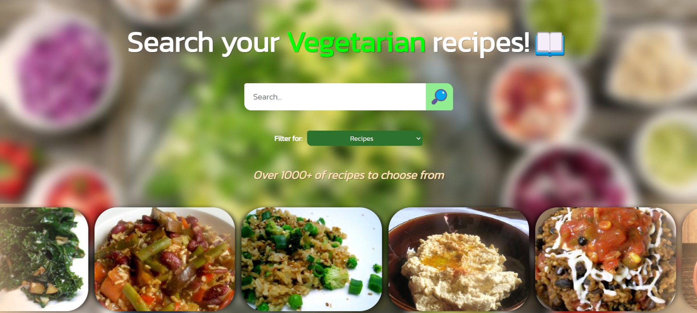

# Veggie Palate 🥗




# Description 📝

This project is a React web application for searching and viewing vegetarian recipes. It utilizes Redux for state management and Axios for making HTTP requests to the Spoonacular API to fetch recipe data.

## Features ⚙️

- Search for vegetarian recipes using various filters.
- View detailed information about individual recipes, including ingredients and instructions.
- Navigate between different pages using React Router.
- Display carousel images of vegetarian recipes on the home page.

## Installation 🧑‍🔧

1. Clone the repository to your local machine:

   ```bash
   git clone https://github.com/your-username/your-repository.git
   ```

2. Create an .env file in the root directory and add your Spoonacular API key:

   ```bash
   VITE_REACT_APP_API_KEY = "YOUR_SPOONACULAR_API_KEY"
   ```

3. Install dependencies:

   ```bash
   cd your-repository
   npm install
   ```

4. Start the development server:

   ```bash
   npm run dev
   ```

## Usage 🕹️

- Enter your search query and select filters such as cuisine, ingredients, etc.
- Upon opening the application, you will land on the home page where you can search for recipes.
- Press the search button or hit Enter to view search results.
- Click on a recipe to view detailed information including ingredients and instructions.
- Navigate back to the home page or other pages using the navigation bar.

## Technologies Used 🚀

- React
- Redux
- React Router
- Axios

## Author ✍🏼

- [@Atlashish](https://github.com/Atlashish/)
